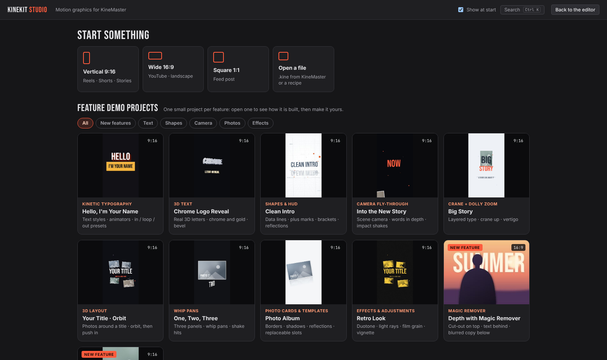

# Kinekit Studio: changes made in this repo

The latest Studio is always `Kinekit_Studio.html` in this folder. The copies inside each project folder are the same file.

## An organised workspace (stage 1 of the redesign)

The Studio is reorganised around what you are doing, and it opens on a start screen with a demo project for each feature.

### Start screen

Click **KINEKIT STUDIO** (top left) to get back to it at any time.

- **Continue:** reopens your last session.
- **New project:** pick a shape: 9:16, 16:9 or 1:1.
- **Open a file:** a `.kine` from KineMaster or a recipe.
- **Show at start:** untick it to start straight in the editor.

### Feature demo projects

One small project per feature, with filters (All, New features, Text, Shapes, Camera, Photos, Effects):

| Demo | Feature |
|---|---|
| Hello, I'm Your Name | Kinetic typography |
| Chrome Logo Reveal | 3D text, chrome and gold |
| Clean Intro | Shapes and HUD |
| Into the New Story | Camera fly-through |
| Big Story | Crane and dolly zoom |
| Your Title · Orbit | 3D layout |
| One, Two, Three | Whip pans |
| Photo Album | Photo cards and templates |
| Retro Look | Effects: duotone, light rays, grain, vignette |
| Depth with Magic Remover | A drawn stand-in person, already cut out, with SUMMER behind them |
| Beat Sync Reel | A 128 BPM drum track generated inside the app, found by beat detection; cuts on bars |

The app ships with no third-party media; the thumbnails were rendered by the Studio itself.

### Top bar

- **Project button:** shows the title, shape and length, and opens **Project settings** in a dialog. Everything that used to fill the right panel (title, canvas, background, length, speed, music, KineMaster version, perspective, keyframe optimizer) now lives there.
- **Modes:**
  - **Edit:** build the scene.
  - **Animate:** turns on the curve editor and the Animate or Camera tab.
  - **Export:** see below.
- **Search (Ctrl+K):** type to find and run any command, effect or demo project. Use the arrow keys and Enter.

### Properties panel

- **Tabs:** labelled and in a fixed order: Transform · Text / Photo / Clip / Shape / Effect · Animate · 3D · Template · Camera. The layer's name sits above them.
- **Explanations:** the long help paragraphs are folded away behind the ⓘ button. Status lines and warnings stay visible.

### Left panel

The tabs are now Layers, Library and Media. Template slots appear in Export mode.

### Export mode

A live check of the project, sorted by importance, with one-click fixes:

- **Problems:** photos or clips missing from this browser.
- **Soft photos:** photos enlarged more than 1.25×.
- **Music:** music that is not in this browser.
- **Template slots:** issues with a slot.
- **Information:** Magic Remover status, real 3D text, hidden layers, slot count and size.

The right panel holds Export .kine, Save recipe, Template guide and the KineMaster settings.

### Fixed along the way

- Sizing a photo or clip whose picture was still loading no longer throws an error.
- With nothing selected, the panel says so instead of jumping to the project settings.

### Patch and tests

- **Patch:** `patches/07_workspace.py`. The demo thumbnails are in `patches/07_demo_thumbs/`.
- **Tests:** a `.kine` export of DRIVEN 146 is identical in content (80 layers, 492 keys, 12 Magic Remover masks, 0 angle jumps). The offset/origin, Magic Remover and duplicate tests pass unchanged.

## Magic Remover, per-layer Blur, and independent duplicates

### Magic Remover (KineMaster background removal)

Photo and video layers have a **Magic remover** section with a "Remove the background" switch.

- **Export:** the `.kine` gets KineMaster's own switch, so KineMaster makes the cut-out on the phone and redoes it when the photo or clip is replaced. The field layout comes from a KineMaster 8 project:
  - **Photos:** field 119 = 1, plus a `.mask` file next to the picture (field 121). The mask is a 352 × 352 PNG stretched over the whole image, with a hard cut in RGB and a soft matte in alpha.
  - **Clips:** field 144 = 1. KineMaster cuts every frame, and there's no mask file.
- **Preview:** the Studio shows the cut-out right away. The mask comes from one of three sources:
  - **The recipe**, which can carry it.
  - **An imported PNG** (alpha, or black and white).
  - **Automatic detection:** MediaPipe DeepLab v3 finds the subjects and Magic Touch cuts each one out. It loads from the CDN the first time and takes about 1–2 s per photo. Clips are cut out in the preview as they play.
- **Photos only:** Magic Remover uses the photo as it is, so turning it on switches off the photo's shape, border and shadow.
- **Opening a `.kine`** restores Magic Remover, its mask and the blur.

### Blur this layer

A slider writes KineMaster's built-in Blur (`com.nexstreaming.csd.blurall`, block size 0–30) as an effect on that one layer: field 125 for photos, 150 for clips. The bytes are identical to what KineMaster writes. For instant depth, duplicate a layer, blur the lower copy and remove the background on the upper one.

### Fixed: clips exported with Magic Remover on

The built-in KineMaster 8 video template had field 144 = 1 (and 142/143 = 352), so every exported clip had Magic Remover switched on in KineMaster. Clips now export with it off unless you turn it on.

### Fixed: duplicates tied to the original

A duplicated layer used to keep the original's name, its template-slot label and its photo media id. That made the two indistinguishable in the Outliner and Template tab, and replacing the picture in the Media bin swapped both. A duplicate now gets:

- its own name ("Car 2"),
- its own slot label ("Rally 2"),
- its own photo media id.

### Patch

`patches/06_magic_remover.py`

## No more spinning Angle keys in the KineMaster export

Layers no longer spin or twitch around their Angle in KineMaster.

- **Before:** the exporter folded every angle into 0–360, so a tilt or wobble through 0° was written as, say, 0.7°, 359.6°, 0.5°.
  - The Studio preview interpolates angles the short way, so it looked right in the Studio.
  - KineMaster interpolates the stored numbers literally, so it spun the layer almost a full turn between those keys.
  - DRIVEN 146 had 107 of these flips on 26 layers.
- **Now:** right before keyframes are written, each layer's angles become one continuous signed curve.
  - The first key sits in −180…180.
  - Each next key uses the equivalent angle nearest the previous one, so 359.6 after 0.7 is written as −0.4.
  - Float noise below 0.01° is written as exactly 0.
  - The fix is in the one function every layer passes through (`cleanKfs`), so it covers text, images, shapes, 3D text and offsets.
- **Measured:** DRIVEN 146 exported again has 0 flips, with the same 521 keys.
- **Patch:** `patches/05_continuous_angle_keys.py`.
- **Tip:** camera shake with a rotation amount puts small Angle keys on every layer it touches. For KineMaster-bound edits, a position-only shake (rotation 0) keeps the Angle track clean. The DRIVEN 146 recipe now does this.

## Smooth video playback (no flicker)

Video layers no longer blink or stutter while the preview plays.

- **Before:** on every drawn frame, the Studio seeked each visible clip to its exact time. While a seek ran the clip had no frame ready, so the layer was skipped and flashed. That was worst with several clips on screen, such as a framed card over its blurred plate, and the seeking also slowed playback.
- **Now, during playback:**
  - Clips really play at the right speed and are re-synced only if they drift by more than 0.25 s.
  - A clip that isn't ready keeps showing its last good frame.
  - Clips about to come on screen are cued to their first frame 0.6 s early.
  - Clips are paused when playback stops or they leave the screen.
- **Unchanged:** scrubbing, frame stepping, offline renders and the KineMaster export still use frame-accurate seeks.
- **Measured** on the Diwali campaign:
  - Fast montage: 18 blinks in 3.4 s before, 0 after.
  - People section: frame rate went from about 10 to about 23 fps.
  - Every section: 0 blinks.

## Offset mode: re-transform without adding keys (Shift+O)

A layer can carry an **offset** (move X / Y / depth, rotation, scale, 3D tilt) that sits on top of its whole animation.

- **Turning it on:** press **Shift+O**, pick **Offset all keys** in Object › Transform › Edits, or use Object menu › Offset mode. A cyan **OFFSET MODE** tag shows in the viewport while it's on.
- **What changes:** G / R / S in the viewport, the rotate and scale handles, and every Transform field now shift the whole animation. Every key keeps its timing and easing, no key is added or changed, and the key diamonds are hidden.
- **Turning it off:** Shift+O again. Edits key the transform at the playhead as before, and the offset stays applied on top. Keys are written without the offset, so it is never counted twice.
- **Panel controls:** the panel lists the current offset. **Bake into keys** writes it into every key (or the still layer) and clears it, so the motion looks identical. **Reset offset** removes it.
- **Saving and export:** recipes save the offset (`xo`). The KineMaster export bakes it into the exported keyframes as usual.

## Origin: pivot point for rotation and scale (Shift+P)

Each layer has an **origin**: the point its rotation and scale turn around. By default it's the layer centre.

- **Panel:** in Object › Origin, set **Origin X / Y** (px from the layer centre), or click one of the **9 snap buttons** (corners, edge midpoints, centre).
- **Viewport:** **Shift+P** (or **Move in viewport**) moves the origin with the mouse. It snaps to the layer's edges and centre; hold Ctrl for free placement and X / Y to lock an axis. A blue crosshair shows the origin on the selected layer.
- **Keep the layer in place** (on by default): moving the origin doesn't make the layer jump at the playhead. The compensation goes into the layer's offset, never its keys. Turn it off to let the layer move with its new pivot.
- **Behaviour:** it applies to keyed rotation and scale, the offset, and R / S in the viewport. With no rotation and 100% scale the origin never changes where a layer sits. 3D tilt still turns around the layer centre.
- **Saving and export:** recipes save the origin (`org`). The KineMaster export bakes it into the exported keyframes.

## Earlier patches

- **Corner-pin layers:** the base transform is fitted to the true screen shape, which removes the 0.1 s warps in KineMaster.
- **Recipe images:** saving a recipe keeps transparent images (stickers) as PNG.
- **Recipe clips:** recipes can carry their video clips (`studio_videos`). They load on open and are packed again on Save recipe.

`patches/04_smooth_video_playback.py` (`python3 04_smooth_video_playback.py OLD.html NEW.html`) reapplies the playback fix; `patches/03_offset_and_origin.py` reapplies the offset and origin change to an older Studio file: `python3 03_offset_and_origin.py OLD.html NEW.html`.
